## 如何用docsify搭建个人博客

- ## 前言

  为什么要搭建个人博客，个人博客有什么用？接下来以我个人的看法讲讲。

  首先，做为大学生我们将会进入大学学习，找工作时我们该如何展示自己四年的学习成果呢？你只需要将个人博客放到你简历上，就可以让面试官知道你这四年没白学。

  其次，个人博客可以记录你所学的知识并把他们整理分类，这就相当于一个笔记本，以后可随时更新和随时阅读。

  接下来我就来教你如何用docsify构建个人博客。

- ## 一 、安装docsify和node.js并部署

  -  [docsify官网下载](https://docsify.js.org/#/)

  - [nodej.js官网下载](https://nodejs.org/zh-cn/download/)

  - 这两个工具都安装好后，在键盘按win+R快捷键打开运行并输入cmd回车，打开命令提示符。

    

    接着在输入npm i docsify-cli -g回车，表示本地部署docsify，接着输入docsify init ./docs,表示初始化docsify本地服务。

然后根据所显示的地址找到你的docs文件夹，这就时docsify本地网页。

然后我们再输入 docsify serve docs 回车，我们就可以获得一个预览地址http://localhost:3000, 我们用浏览器访问这个地址就能看到自己的博客了，但此时只有你的电脑能访问，且什么内容都没有，每次你关闭命令提示符时，这个预览地址就会消失，得重新输入docsify serve docs 回车 才行

  

* ## 二、完善个人博客

  * 1. [学习markdown](https://www.runoob.com/markdown/md-tutorial.html)(起对润色你的博客十分重要)
    2. 下载支持markdown文档的编辑器，例如：[Typora](https://apps.qachwl.cn/app/11/typora?bd_vid=10053636818437736761)
    3. 当你学会使用以上两个工具时，你就可以给你的博客添加内容了。
  
    首先是主体编写，用编辑器打开docs文件夹中的README.md （博客的主体） ,你可以在上面输入各种内容，输完后再用ctrl+s快捷键保存然后打开预览网址http://localhost:3000 ，你就可以看到自己所写的内容。
  
    你所编写的内容
    
    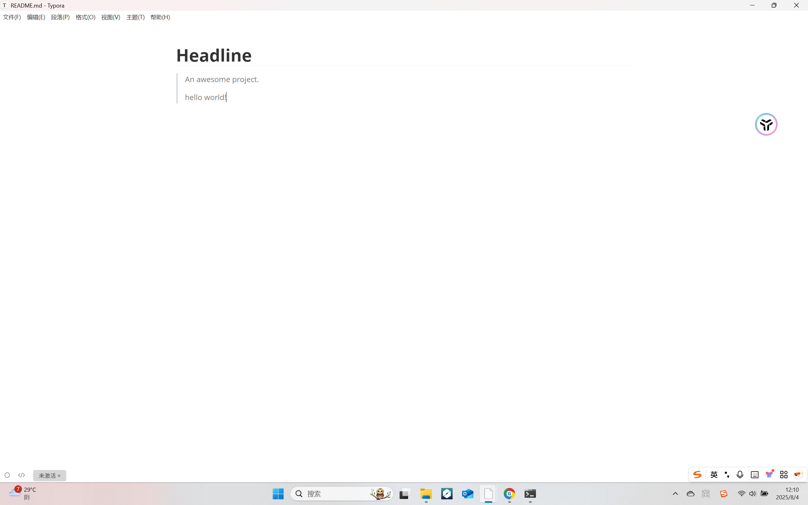
    
    浏览器所看到的如下

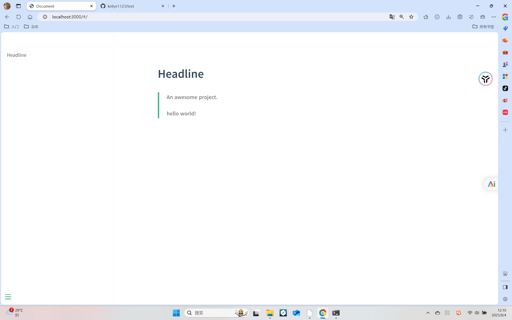

然后找到docs文件夹中的的index并用编辑器打开，name:''是你侧边栏的标题，repo:''可以在博客右上角添加你的Gitee账号入口，loadNavbar: true 用来加载顶部导航栏，loadsidebar:true 加载侧边导航栏，coverpage:ture 加载封面，subMaxlevel: 目录最大层数（要注意用逗号要用英文的不能用中文的）

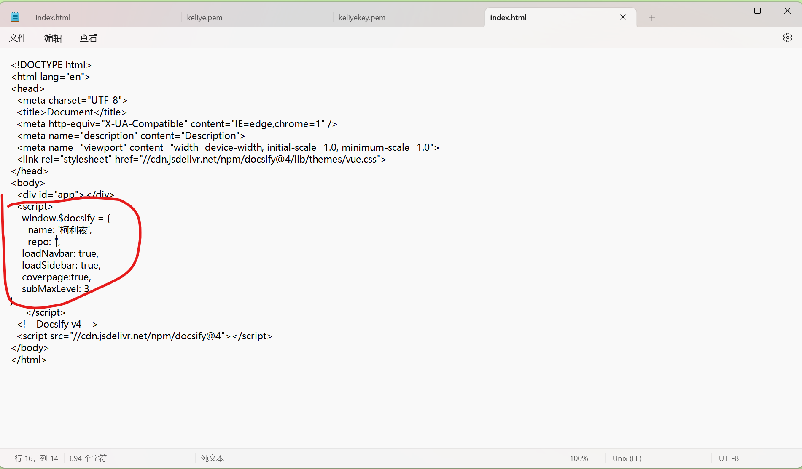

之后你要分别在docs文件夹中创建 命名为_navbar， _sidebar和 _coverpage的三个md文件，编写内容并保存就可以显示到你的博客上了。

_ coverpage

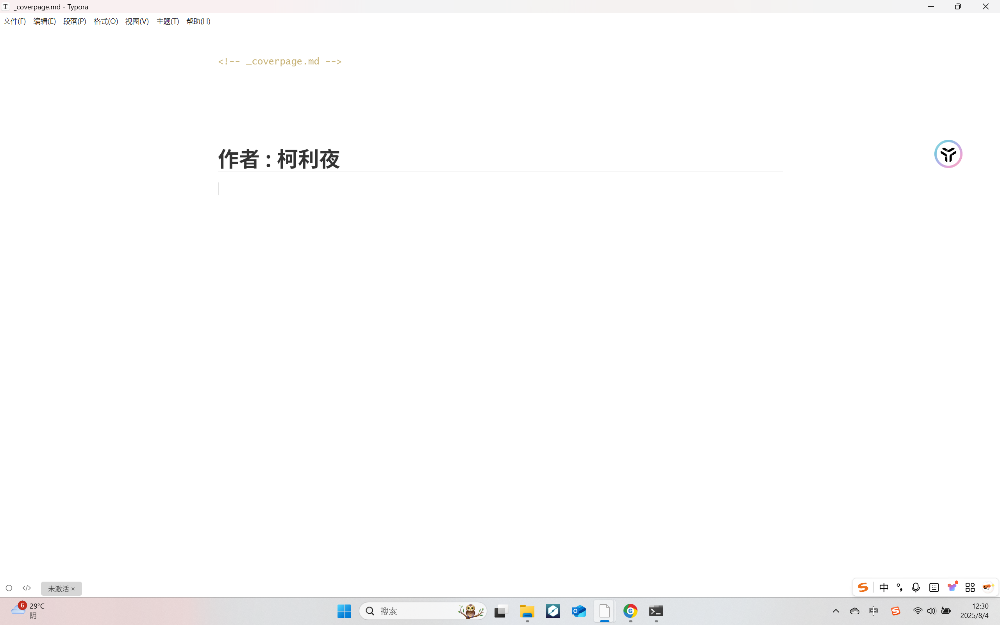

_ sidebar

_ navbar

最终效果

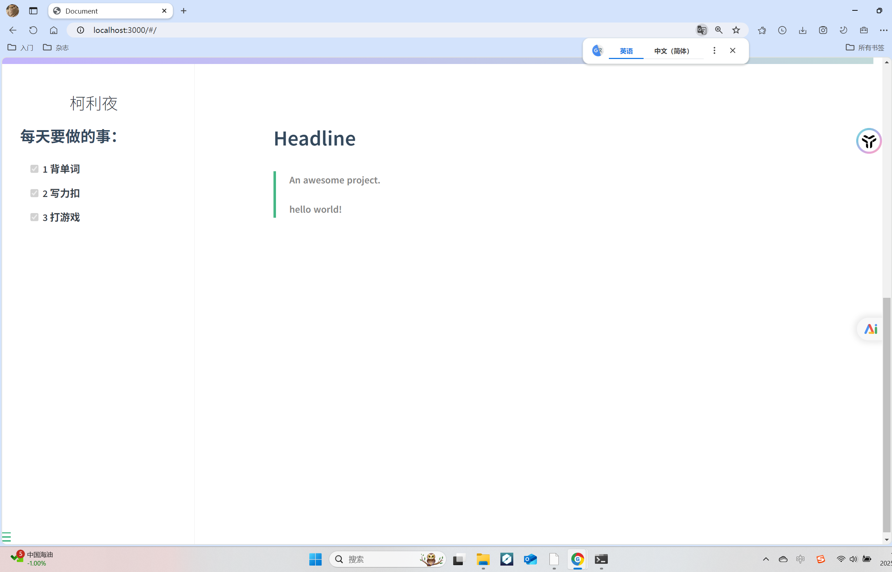

- ## 三、使个人博客能够被访问

  这里给大家提供用 GitHub 仓库来搭建博客

  - 优点：规范、部署不限制、自由度高、配置域名不收费，不用购买服务器
  - 缺点：国内访问速度慢，仓库不能设置私有

  1、[注册GitHub](https://github.com)（以下操作最好在翻墙下进行，不然会很卡）

  2、创建个人仓库

  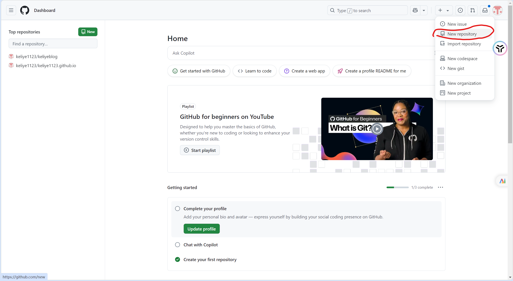

  给仓库取名再创建仓库

  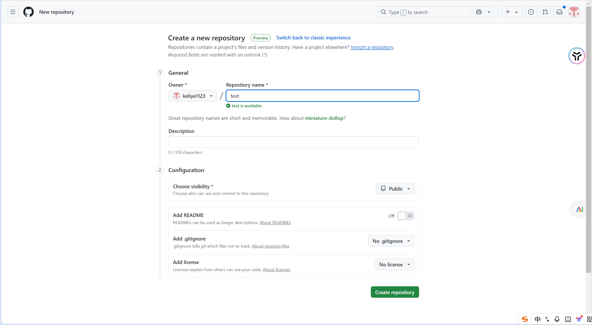

  

  3、 [官网下载git](https://git-scm.com/)

  接下来是关于git 的操作如果想了解git请跳转到[git教程](https://liaoxuefeng.com/books/git/introduction/index.html)

  不想的话就照着以下操作进行

  ctrl+R 回车并输入git -v,检查是否安装成功，如下显示版本号则安装成功。

  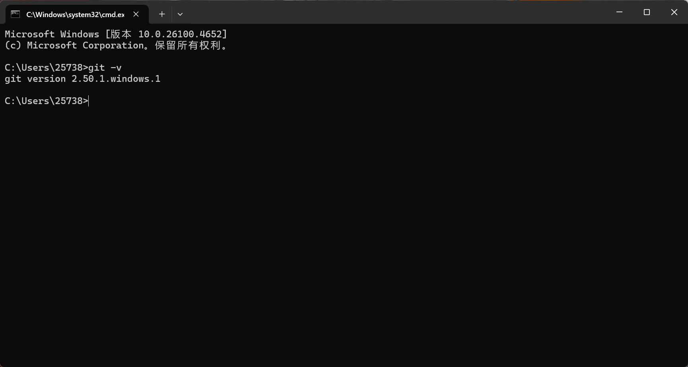

4、在docs文件夹输入cmd

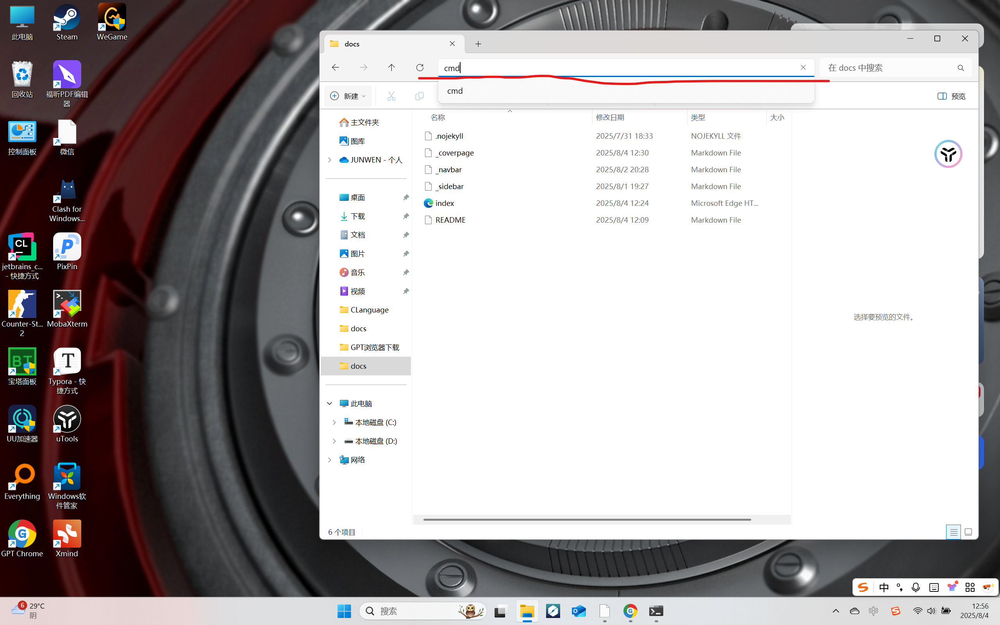

然后输入 git init   (表示git初始化) 再输入 git status   （表示检查文件情况，红体字未添加文件） 

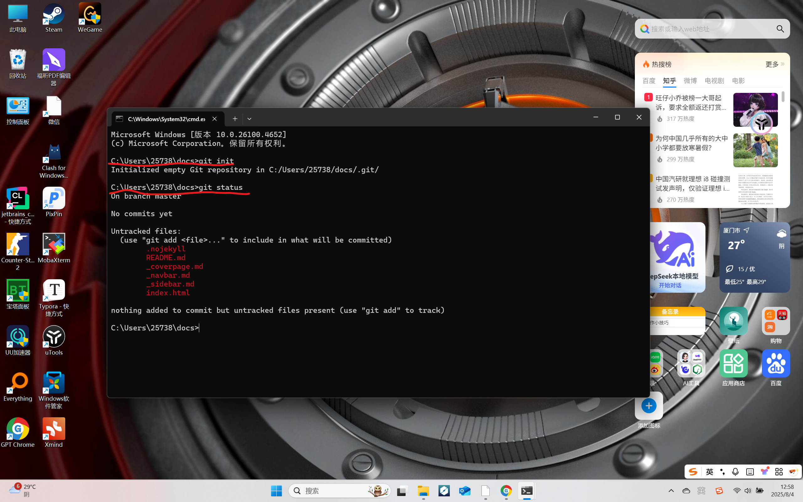

接着输入 git add"--all" （表示添加所以文件），再输入git status (再次检查文件情况)，显示绿体字，表示添加成功,最后输入

git commit -m"测试"    （-m后表示提交备注）

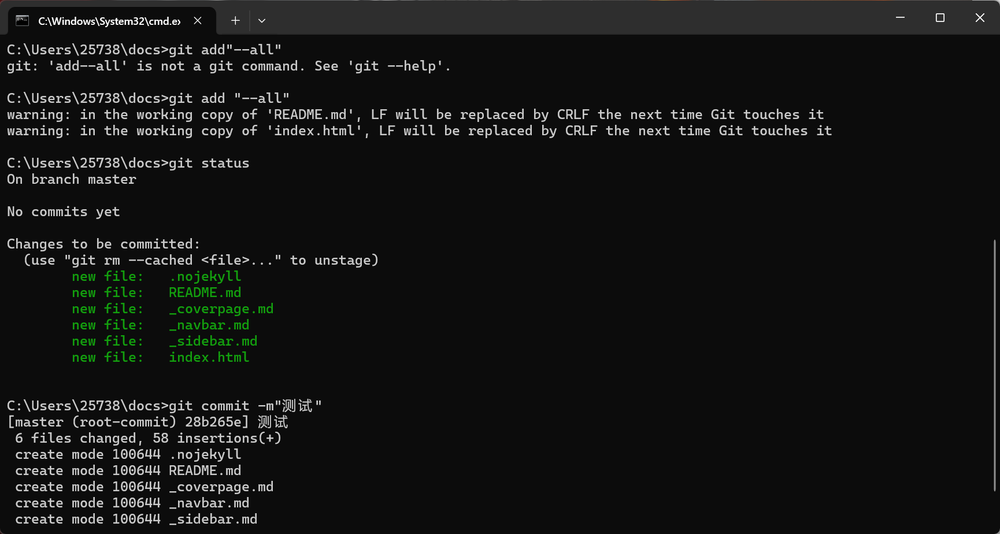

之后输入 git remote add origin 你git仓库的网址+git

以我的仓库为例，则输入为 git remote add origin https://github.com/keliye1123/text.git

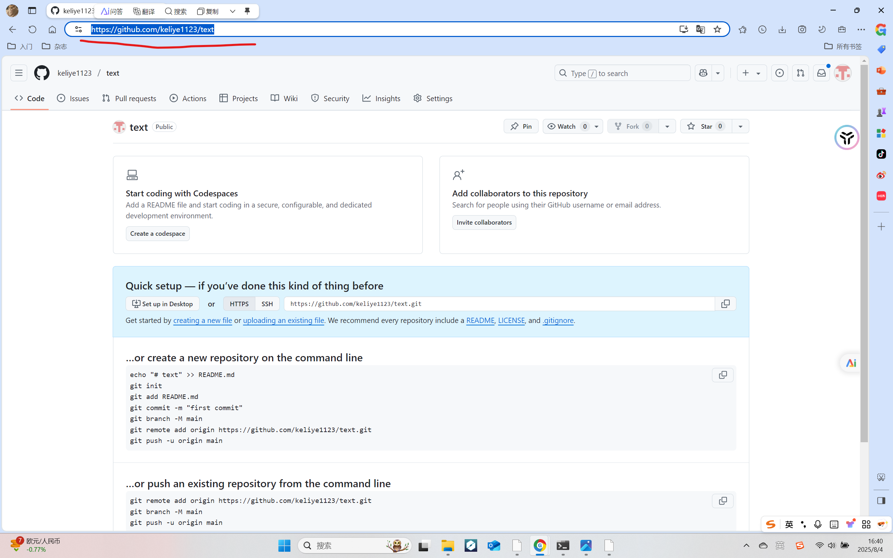

接着输入 git push -u origin master  (表示将我们提交的文件上传到我们的git仓库中)，这步是最费时间的，因为网络问题我们会失败很多次，所以要一直输入 git push -u origin master 直到它完成,

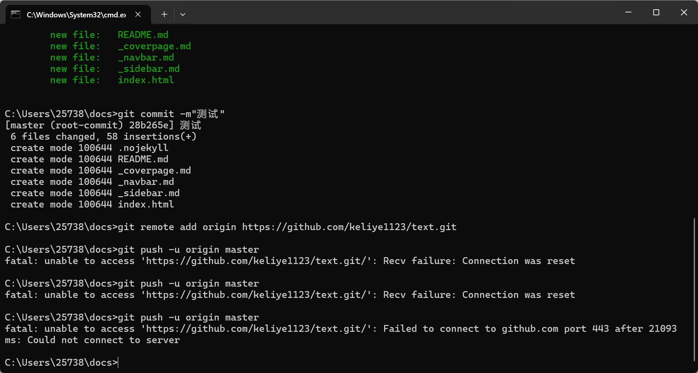

显示如下则表示上传成功

接着打开仓库,刷新以下就可以看到我们上传的文件，然后点击settings再在左边列表中点击page最后将none换为master再点击save

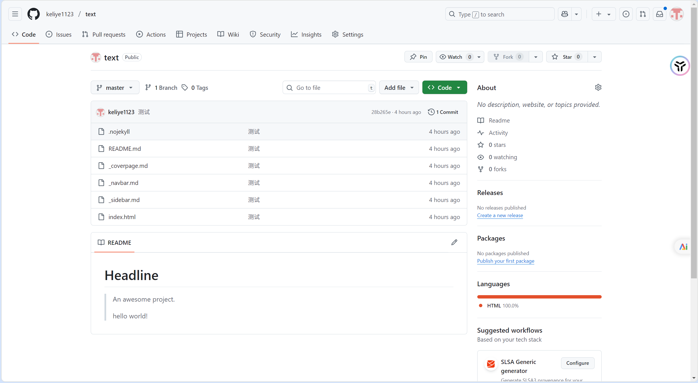

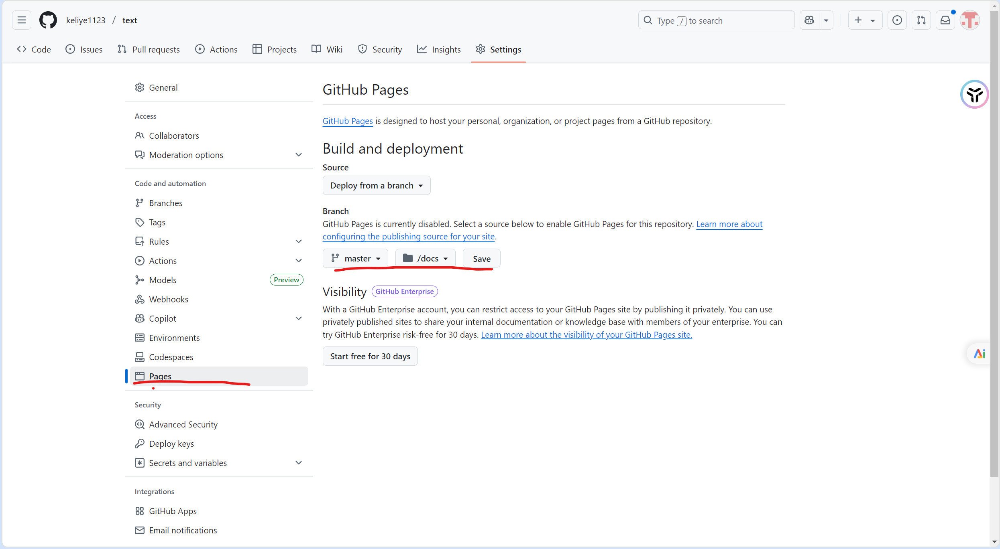

我们稍微等一会儿，刷新几下网页,我们就可以看到他给我们创建的网址，这样别的设备就可以通过这个网址浏览你的个人博客了！！

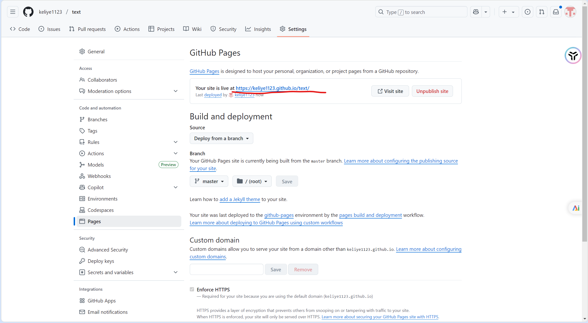

* ## 更新个人博客

更新个人博客们只需要在本地docs夹里修改，然后再在docs文件夹输入cmd（和之前的操作一样），输入git status  可以显示你所修改的内容

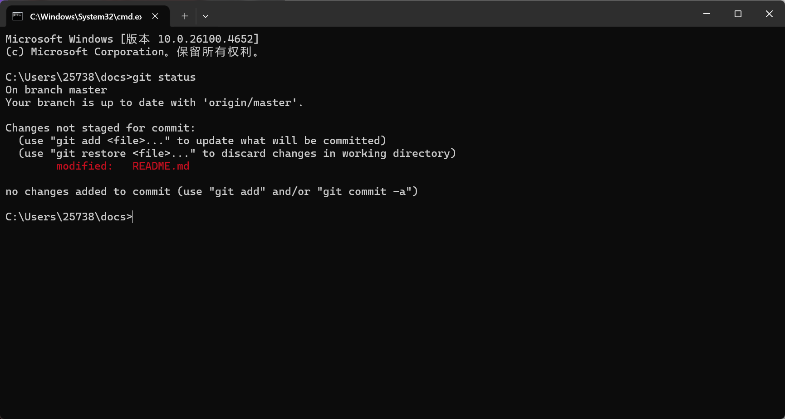

重复之前操作 git add “--all”  ， git status  ，  git commit -m"add" ，git status  ，git push -u origin master，其中git status 是检查步骤可以省略。

如果还有什么问题可以来找我来解决哈^_^

