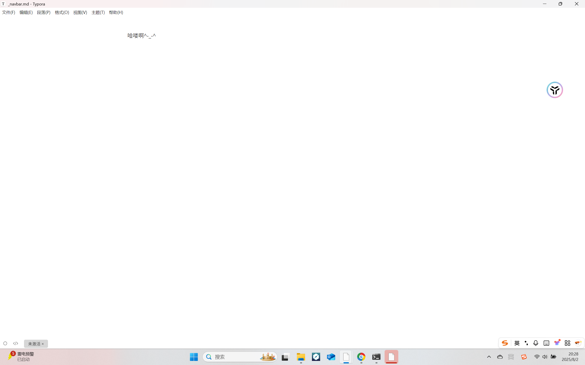

## 如何用docsify搭建个人博客

- ## 前言

  为什么要搭建个人博客，个人博客有什么用？接下来以我个人的看法讲讲。

  首先，做为大学生我们将会进入大学学习，找工作时我们该如何展示自己四年的学习成果呢？你只需要将个人博客放到你简历上，就可以让面试官知道你这四年没白学。

  其次，个人博客可以记录你所学的知识并把他们整理分类，这就相当于一个笔记本，以后可随时更新和随时阅读。

  接下来我就来教你如何用docsify构建个人博客。

- ## 一 、安装docsify和node.js并部署

  -  [docsify官网下载](https://docsify.js.org/#/)

  - [nodej.js官网下载](https://nodejs.org/zh-cn/download/)

  - 这两个工具都安装好后，在键盘按win+R快捷键打开运行并输入cmd回车，打开命令提示符。

    

    接着在输入npm i docsify-cli -g回车，表示本地部署docsify，接着输入docsify init ./docs,表示初始化docsify本地服务。

然后根据所显示的地址找到你的docs文件夹，这就时docsify本地网页。

然后我们再输入 docsify serve docs 回车，我们就可以获得一个预览地址http://localhost:3000, 我们用浏览器访问这个地址就能看到自己的博客了，但此时只有你的电脑能访问，且什么内容都没有，每次你关闭命令指示符时，这个预览地址就会消失，得重新输入docsify serve docs 回车 才行

  

* ## 二、完善个人博客

  * 1. [学习markdown](https://www.runoob.com/markdown/md-tutorial.html)(起对润色你的博客十分重要)
    2. 下载支持markdown文档的编辑器，例如：[Typora](https://apps.qachwl.cn/app/11/typora?bd_vid=10053636818437736761)
    3. 当你学会使用以上两个工具时，你就可以给你的博客添加内容了。
  
    首先是主体编写，用编辑器打开docs文件夹中的README.md （博客的主体） ,你可以在上面输入各种内容，输完后再用ctrl+s快捷键保存然后打开预览网址http://localhost:3000 ，你就可以看到自己所写的内容。
  
    

然后找到docs文件夹中的的index并用编辑器打开，name:''是你侧边栏的标题，repo:''可以在博客右上角添加你的Gitee账号入口，loadNavbar: true 用来加载顶部导航栏，loadsidebar:true 加载侧边导航栏，coverpage:ture 加载封面，subMaxlevel: 目录最大层数（要注意用逗号要用英文的不能用中文的）

之后你要分别在docs文件夹中创建 命名为_navbar， _sidebar和 _coverpage的三个md文件，编写内容并保存就可以显示到你的博客上了。

_ coverpage

_ sidebar

_ navbar

