# 1. 如何搭建个人博客

##  1. 1.1. 前言

  

  为什么要搭建个人博客，个人博客有什么用？接下来以我个人的看法讲讲。

  首先，做为大学生我们将会进入大学学习，找工作时我们该如何展示自己四年的学习成果呢？你只需要将个人博客放到你简历上，就可以让面试官知道你这四年没白学。

  其次，个人博客可以记录你所学的知识并把他们整理分类，这就相当于一个笔记本，以后可随时更新和随时阅读。

  接下来我就来教你如何用docsify和GitHub构建个人博客。

##  2. 1.2. 安装docsify和node.js并部署

  

  - [docsify官网下载](https://docsify.js.org/#/)

  - [nodej.js官网下载](https://nodejs.org/zh-cn/download/)

  - 这两个工具都安装好后，在键盘按win+R快捷键打开运行并输入cmd回车，打开命令提示符。

    

    输入npm i docsify-cli -g回车，表示本地部署docsify，接着输入docsify init ./docs,表示初始化docsify本地服务。

[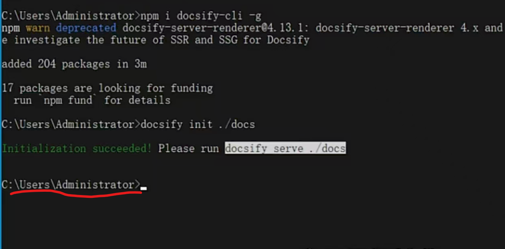](https://github.com/keliye1123/keliyeblog/blob/master/images/1.2.png)

然后根据所显示的地址找到你的docs文件夹，这就时docsify本地网页。

然后我们再输入 docsify serve docs 回车，我们就可以获得一个预览地址[http://localhost:3000](http://localhost:3000/), 我们用浏览器访问这个地址就能看到自己的博客了，但此时只有你的电脑能访问，且什么内容都没有，每次你关闭命令提示符时，这个预览地址就会消失，得重新输入docsify serve docs 回车 才行

##  3. 1.3. 完善个人博客

  

  - 1. [学习markdown](https://www.runoob.com/markdown/md-tutorial.html)(起对润色你的博客十分重要)
    2. 下载支持markdown文档的编辑器，例如：[Typora](https://apps.qachwl.cn/app/11/typora?bd_vid=10053636818437736761)或[VisualStudioCode](https://code.visualstudio.com/docs/?dv=win64user)
    3. 当你学会使用以上两个工具时，你就可以给你的博客添加内容了。

    首先是主体编写，用编辑器打开docs文件夹中的README.md （博客的主体） ,你可以在上面输入各种内容，输完后再用ctrl+s快捷键保存(记得养成编辑完一个文档后就Ctrl+S 保存的习惯)然后打开预览网址[http://localhost:3000](http://localhost:3000/) ，你就可以看到自己所写的内容。

    你所编写的内容

    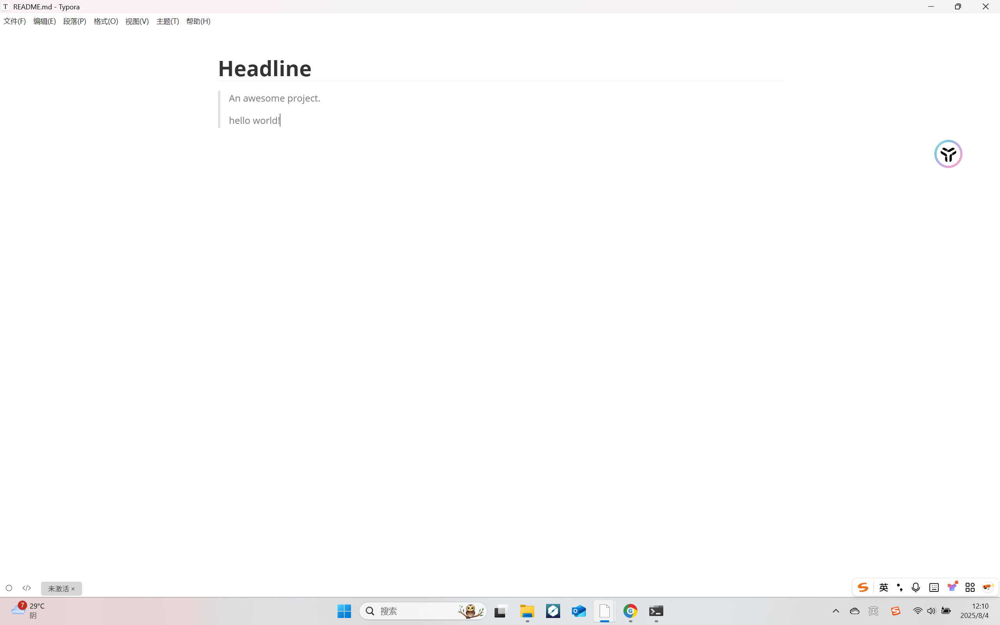

    浏览器所看到的如下

然后找到docs文件夹中的的index并用编辑器打开，name:''是你侧边栏的标题，repo:''可以在博客右上角添加你的Gitee账号入口，loadNavbar: true 用来加载顶部导航栏，loadsidebar:true 加载侧边导航栏，coverpage:ture 加载封面，subMaxlevel: 目录最大层数（要注意用逗号要用英文的不能用中文的）

[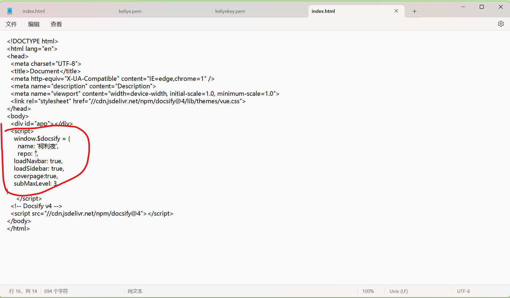](https://github.com/keliye1123/keliyeblog/blob/master/images/1.18.png)

之后你要分别在docs文件夹中创建 命名为_navbar， _sidebar和 _coverpage的三个md文件，编写内容并保存就可以显示到你的博客上了。

_ coverpage

_ sidebar

[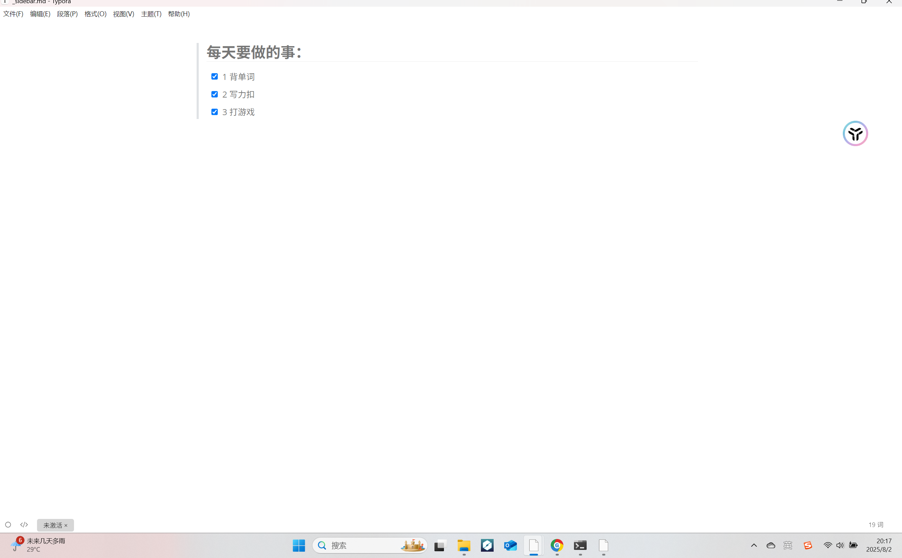](https://github.com/keliye1123/keliyeblog/blob/master/images/1.10.png)

_ navbar

[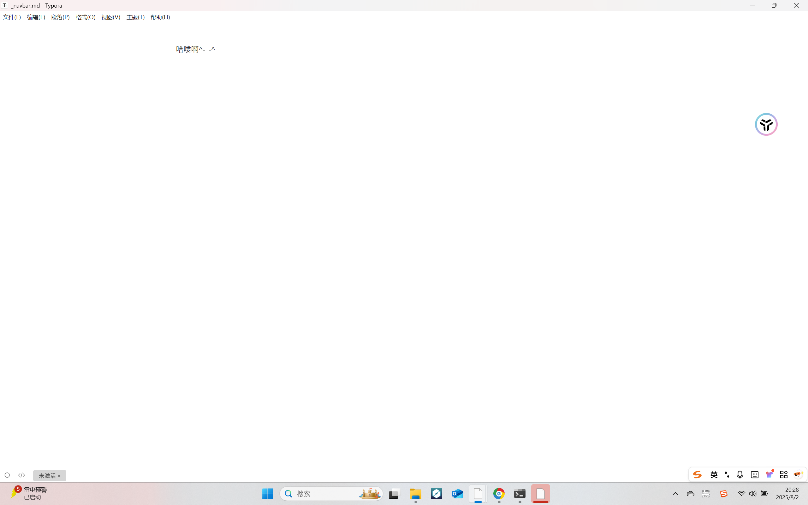](https://github.com/keliye1123/keliyeblog/blob/master/images/1.11.png)

最终效果

[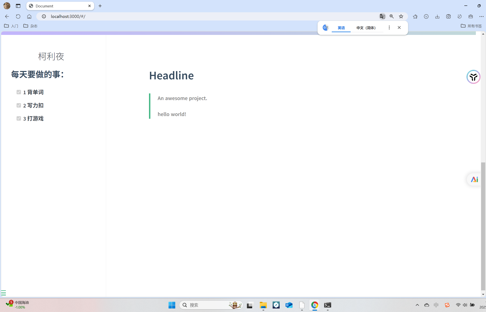](https://github.com/keliye1123/keliyeblog/blob/master/images/1.22.png)

##  4. 1.4. 使个人博客能够被访问

  

  这里给大家提供用 GitHub 仓库来搭建博客

  - 优点：规范、部署不限制、自由度高、配置域名不收费，不用购买服务器
  - 缺点：国内访问速度慢，仓库不能设置私有

  1、[注册GitHub](https://github.com/)（以下操作最好在翻墙下进行，不然会很卡）

  2、创建个人仓库

  [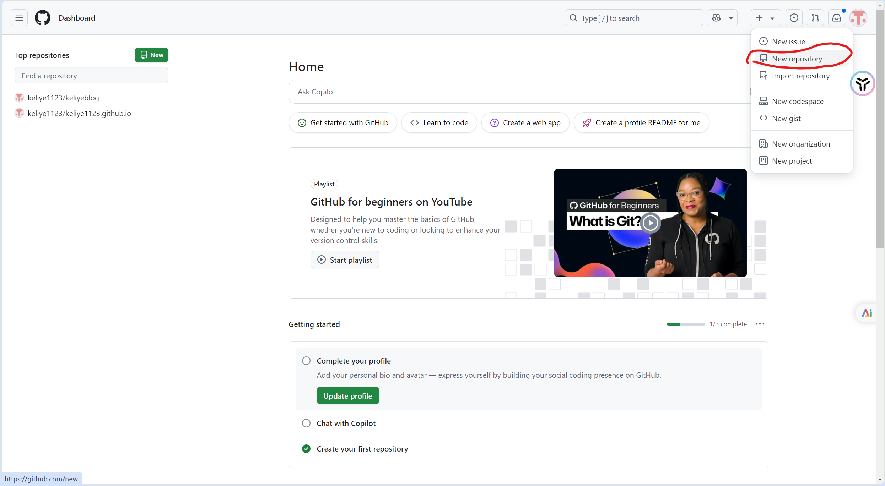](https://github.com/keliye1123/keliyeblog/blob/master/images/1.13.png)

  给仓库取名再创建仓库

  

  3、 [官网下载git](https://git-scm.com/)

  ctrl+R 回车并输入git -v,检查是否安装成功，如下显示版本号则安装成功。

  

4、在docs文件夹输入cmd

[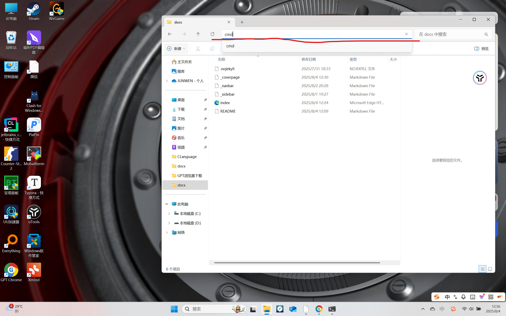](https://github.com/keliye1123/keliyeblog/blob/master/images/1.23.png)

然后输入 git init (表示git初始化) 再输入 git status （表示检查文件情况，红体字未添加文件）

[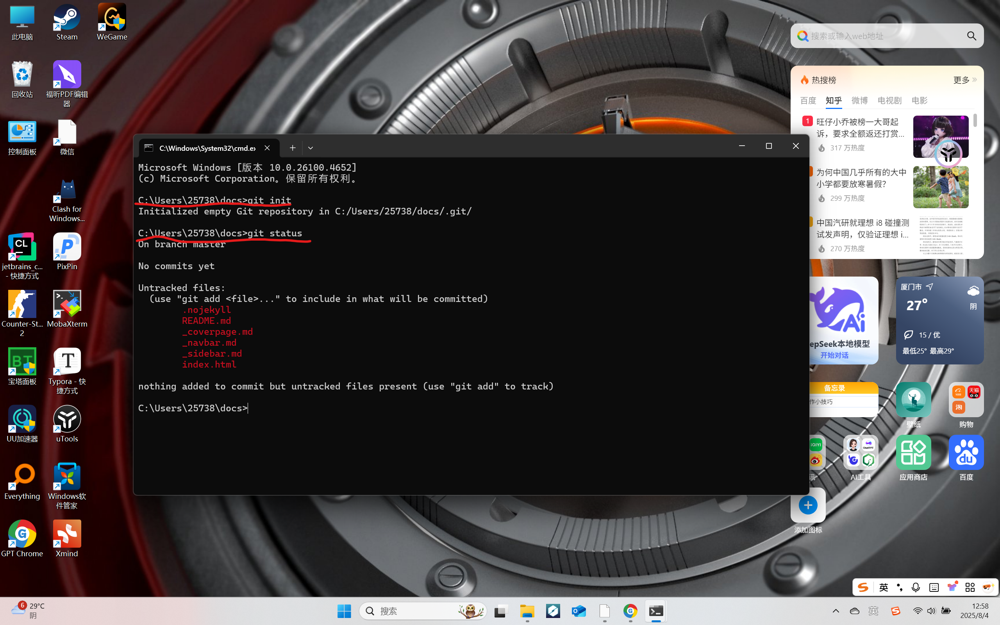](https://github.com/keliye1123/keliyeblog/blob/master/images/1.24.png)

接着输入 git add"--all" （表示添加所以文件），再输入git status (再次检查文件情况)，显示绿体字，表示添加成功,最后输入

git commit -m"测试" （-m后表示提交备注）

之后输入 git remote add origin 你git仓库的网址+git

以我的仓库为例，则输入为 git remote add origin https://github.com/keliye1123/text.git

接着输入 git push -u origin master (表示将我们提交的文件上传到我们的git仓库中)，这步是最费时间的，因为网络不好时我们会失败很多次，所以要一直输入 git push -u origin master 直到它完成,

[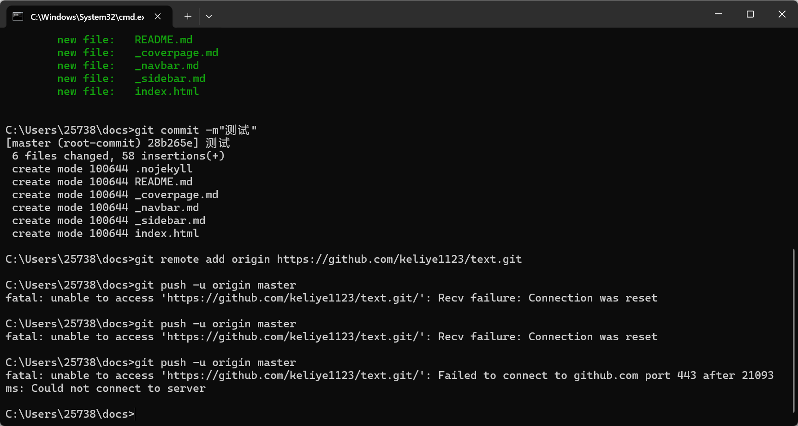](https://github.com/keliye1123/keliyeblog/blob/master/images/1.28.png)

显示如下则表示上传成功

[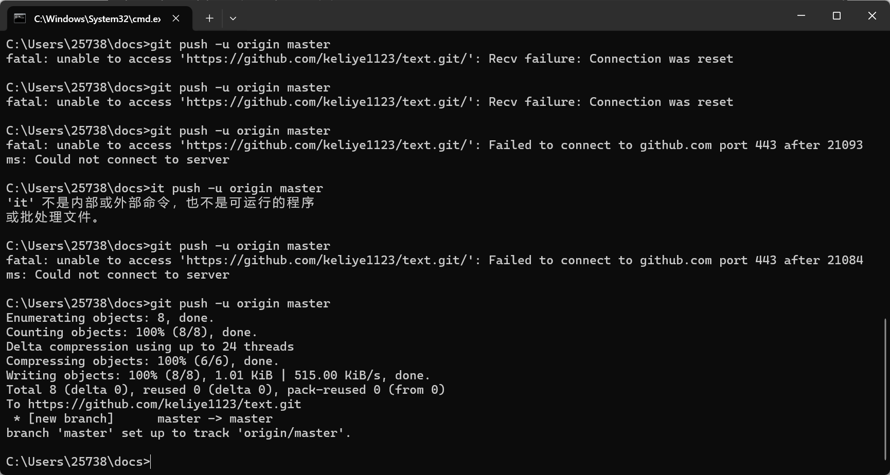](https://github.com/keliye1123/keliyeblog/blob/master/images/1.32.png)

接着打开仓库,刷新以下就可以看到我们上传的文件，然后点击settings再在左边列表中点击page最后将none换为master再点击save

[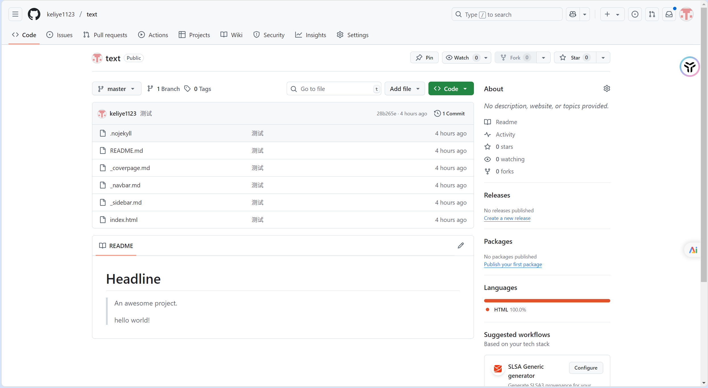](https://github.com/keliye1123/keliyeblog/blob/master/images/1.29.png)

[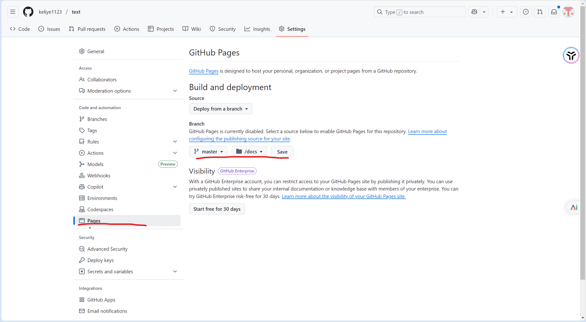](https://github.com/keliye1123/keliyeblog/blob/master/images/1.30.png)

我们稍微等一会儿，刷新几下网页,我们就可以看到他给我们创建的网址，这样别的设备就可以通过这个网址浏览你的个人博客了！！

[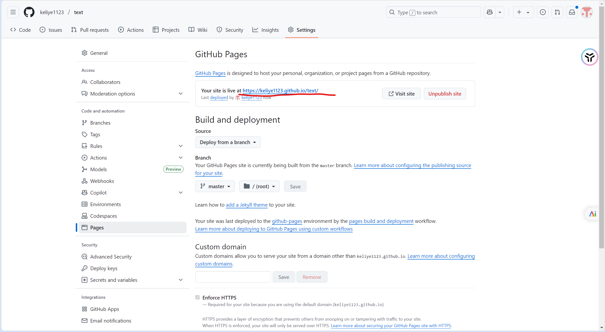](https://github.com/keliye1123/keliyeblog/blob/master/images/1.31.png)

##  5. 1.5. 更新个人博客

  

更新个人博客们只需要在本地docs夹里修改，然后再在docs文件夹输入cmd（和之前的操作一样），输入git status 可以显示你所修改的内容

[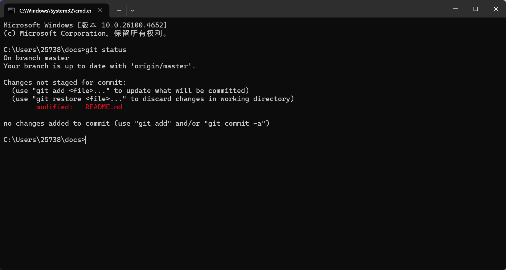](https://github.com/keliye1123/keliyeblog/blob/master/images/1.33.png)

重复之前操作 git add “--all” ， git status ， git commit -m"add" ，git status ，git push -u origin master，其中git status 是检查步骤可以省略。

如果还有什么问题可以来找我来解决哈^_^
