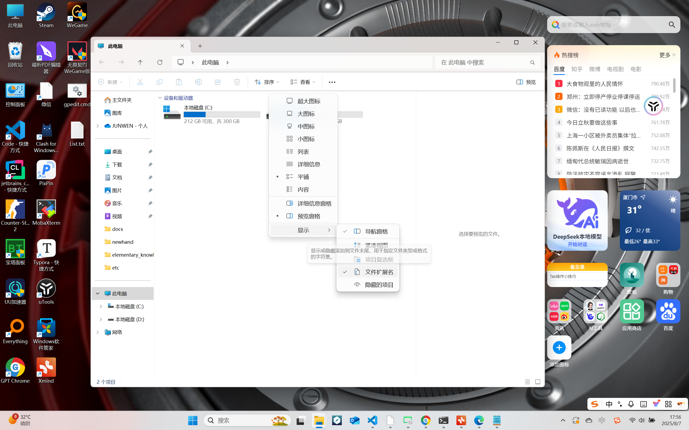
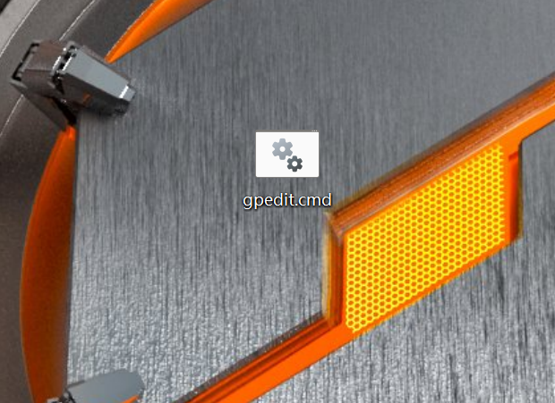
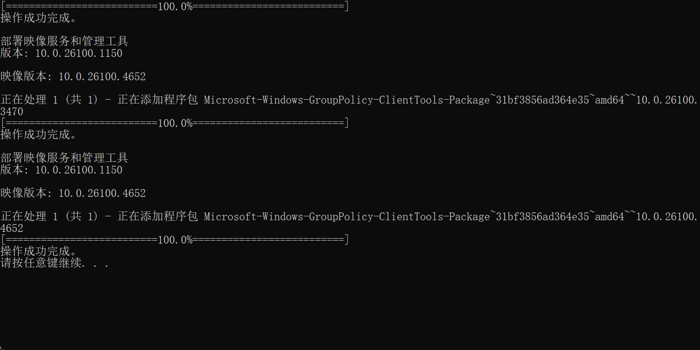
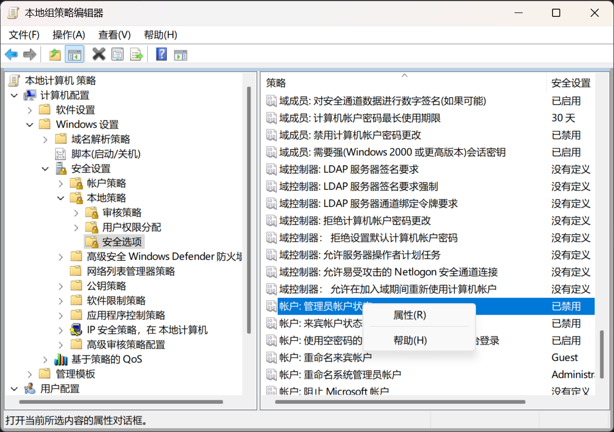

# win11如何获得管理员权限  
  
  ## 前言  
  如果你的电脑是win11系统，你可能在为找不到获得管理员权限的方法而困扰，接下来就来学习下如何在win11系统下获得管理员权限。  
      
### 1.1.创建txt文档并命名为gpedit  


 ### 1.2.将下面的代码复制到txt文档中  

```  
@echo off

pushd "%~dp0"

dir /b C:\Windows\servicing\Packages\Microsoft-Windows-GroupPolicy-ClientExtensions-Package~3*.mum >List.txt

dir /b C:\Windows\servicing\Packages\Microsoft-Windows-GroupPolicy-ClientTools-Package~3*.mum >>List.txt

for /f %%i in ('findstr /i . List.txt 2^>nul') do dism /online /norestart /add-package:"C:\Windows\servicing\Packages\%%i"

pause  
```  
### 1.3.重命名gpedit文件的扩展名改为cmd  
如果显示不了扩展名就打开  此电脑 -> 查看 -> 显示 ->勾选文件扩展名
  
  
然后右键这个gpedit.cmd 点击以管理员身份运行,  
  
  
  ### 1.4.win+R 输入gpedit.msc 点击确定（打开本地组策略编辑器）  
windows设置 -> 安全设置-> 本地策略 -> 安全选项 -> 找到管理员账户状态 -> 右键点击属性 -> 点击启用，然后确定   
  
这样就可以选择是否打开管理员权限了。